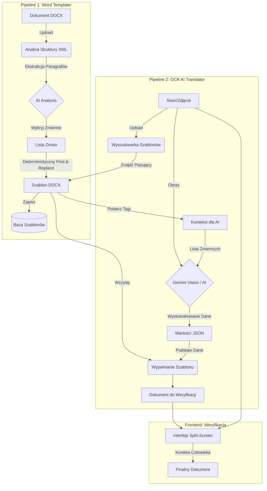

# Dokumentacja Architektury Systemu: Word Templater & OCR AI

**Wersja:** 1.0  
**Data:** 30 Listopada 2025  
**Status:** Research & Development / Produkcja MVP

---

## 1. Przegląd Systemu

Projekt **Word Templater & OCR AI** to kompleksowe rozwiązanie służące do automatyzacji tłumaczenia i cyfryzacji dokumentów (głównie celnych i samochodowych) przy użyciu Generatywnej Sztucznej Inteligencji (GenAI).

### 🎯 Główny Cel
Stworzenie systemu, który potrafi przetłumaczyć skan dokumentu (obraz) na edytowalny plik Word, zachowując oryginalny układ graficzny, formatowanie i strukturę.

### 💡 Kluczowa Koncepcja: "Kontekstowe OCR"
Zamiast polegać na prostym OCR (zamiana obrazu na tekst), system wykorzystuje **szablony**.
1.  **Baza Wiedzy:** System przechowuje "szablony" (dokumenty Word z oznaczonymi zmiennymi miejscami).
2.  **Kontekst dla AI:** Podczas analizy skanu, AI otrzymuje nie tylko obraz, ale też "mapę" tego, czego szukać (listę zmiennych z szablonu).
3.  **Wynik:** AI wypełnia gotowy, idealnie sformatowany szablon danymi odczytanymi ze zdjęcia, zamiast próbować odtwarzać układ dokumentu od zera.

---

## 2. Architektura Wysokopoziomowa

System składa się z dwóch głównych potoków przetwarzania (pipelines):

1.  **Word Templater (Tworzenie Szablonów):** Zamiana surowych dokumentów DOCX na szablony ze zmiennymi `{{tag}}`.
2.  **OCR AI Translator (Wypełnianie Dokumentów):** Odczyt danych ze skanów i wypełnianie nimi szablonów.

### Diagram Przepływu Danych

---

## 3. Szczegółowy Opis Modułów

### 3.1. Moduł Word Templater

Jest to fundament systemu, odpowiedzialny za przygotowanie "matryc" do późniejszego wykorzystania.

*   **Cel:** Automatyczne wykrycie danych zmiennych (daty, numery VIN, nazwiska) w dokumencie Word i zamiana ich na tagi (np. `{{issueDate}}`).
*   **Technologia:**
    *   **Parsowanie XML:** Bezpośrednia praca na `word/document.xml` wewnątrz pliku DOCX.
    *   **Stabilne ID:** Wykorzystanie `w14:paraId` do bezbłędnej lokalizacji tekstu.
    *   **Merged Approach:** Inteligentne łączenie poszatkowanych przez Worda fragmentów tekstu (runów) przed wysłaniem do AI (patrz: `RESEARCH_TEMPLATE_GENERATOR.md`).
*   **Kluczowe Funkcje:**
    *   `analyze-runs.mjs` / `word-templater-pipeline`: Ekstrakcja i analiza.
    *   `apply-llm-changes.mjs`: Aplikacja zmian w XML.
*   **Zasada Działania:** AI dostaje treść paragrafu i decyduje, co jest zmienną. System następnie precyzyjnie podmienia tekst w strukturze XML, nie naruszając stylów ani układu.

### 3.2. Moduł OCR AI (Tłumaczka)

Inteligentny silnik ekstrakcji danych, który "rozumie" dokument dzięki kontekstowi.

*   **Cel:** Wyciągnięcie wartości zmiennych ze zdjęcia/skanu.
*   **Proces:**
    1.  **Analiza Wizualna:** Wykorzystanie modeli multimodalnych (Gemini 1.5 Pro/Flash).
    2.  **Wzbogacony Prompt:** Prompt do modelu zawiera listę pól, których spodziewamy się na dokumencie (pobraną z szablonu). To drastycznie redukuje halucynacje.
    3.  **Layout Parsing:** Opcjonalne wsparcie przez dedykowane API do analizy układu (np. dla tabel).
*   **Funkcje Backendowe:**
    *   `ocr-analyze-document`: Główna logika orkiestracji.
    *   `verify-document-visually`: Dodatkowa weryfikacja wizualna (Visual QA) brakujących pól.

### 3.3. Wyszukiwarka Szablonów

Mechanizm dopasowywania przychodzącego skanu do istniejącego szablonu w bazie.

*   **Zasada:** Na podstawie słów kluczowych lub podobieństwa wizualnego, system wybiera "matrycę", która posłuży do wygenerowania tłumaczenia.

### 3.4. Interfejs Weryfikacji (Human-in-the-loop)

Krytyczny element zapewniający jakość. AI wykonuje 90-95% pracy, ale człowiek ma ostatnie słowo.

*   **Wygląd:** Ekran podzielony na dwie części:
    *   **Lewa strona:** Oryginalny skan/zdjęcie.
    *   **Prawa strona:** Interaktywny podgląd wygenerowanego dokumentu Word.
*   **Funkcjonalność:** Użytkownik może klikać w pola, poprawiać błędy OCR i zatwierdzać dokument. System uczy się na tych poprawkach (feedback loop).

---

## 4. Stack Technologiczny

System zbudowany jest w nowoczesnej architekturze Serverless.

*   **Frontend:**
    *   React + TypeScript
    *   Vite (Build tool)
    *   Tailwind CSS + Shadcn/UI (Komponenty interfejsu)
*   **Backend & Baza Danych:**
    *   **Supabase:** Platforma Backend-as-a-Service dostarczająca:
        *   **Baza Danych (PostgreSQL):** Przechowywanie metadanych i statusów.
        *   **Storage:** Przechowywanie plików (DOCX, PDF, obrazy).
    *   **Edge Functions (Deno):** Logika biznesowa uruchamiana serverless (TypeScript).
*   **Sztuczna Inteligencja:**
    *   **Google Gemini 3 Pro:** Główne modele językowe i wizyjne (przez OpenRouter lub Google AI Studio).
    *   **Integracja:** Modele wybierane dynamicznie w zależności od trudności zadania (koszt vs jakość).

---

## 5. Filozofia Rozwoju (R&D)

Projekt jest prowadzony w trybie badawczo-rozwojowym.

1.  **Determinizm:** Tam gdzie to możliwe, unikamy "zgadywania" przez AI. Operacje na plikach (Find & Replace, budowanie XML) są ściśle deterministyczne. AI służy tylko do decyzji "co jest czym", a nie do generowania struktury pliku.
2.  **Human-in-the-Loop:** Zakładamy, że AI może popełnić błąd. Interfejs jest zaprojektowany tak, aby weryfikacja była szybka i intuicyjna.
3.  **Modularność:** Każdy element (ekstrakcja, OCR, templater) jest niezależnym modułem. Pozwala to na łatwą wymianę modeli AI na nowsze bez przepisywania całego systemu.

---

## 6. Status Funkcjonalności

| Moduł | Status | Uwagi |
|-------|--------|-------|
| **Word Templater** | ✅ Prototyp | Gotowy pipeline w wersji lokalnej (skrypty Node.js). Wymaga pełnej integracji z Supabase Edge Functions. |
| **OCR Extraction** | 🔄 W trakcie | Działa podstawowa komunikacja; trwają prace nad precyzją ekstrakcji i layoutem. |
| **Baza Szablonów** | 🚧 Częściowo | Zaimplementowana komunikacja z API, brak pełnej struktury tabel i bucketów w produkcji. |
| **UI Weryfikacji** | 🚧 Częściowo | Działający podgląd i edycja pól (Frontend). |
| **Wyszukiwarka** | ⏳ Do zrobienia | Planowana implementacja zaawansowanego wyszukiwania (Vector Search?). |

---

## 7. Przydatne Linki

*   [Specyfikacja Techniczna Word Templater](WORD_TEMPLATER_SPECIFICATION.md)
*   [Research: Ekstrakcja Runów](RESEARCH_TEMPLATE_GENERATOR.md)
*   [Struktura Projektu](../.cursor/rules/project_structure.mdc)

---

## 8. Harmonogram i Historia Rozwoju

Projekt realizowany jest etapowo, z silnym naciskiem na iteracyjne ulepszanie algorytmów.

### Etap 1: Fundamenty i Core (Listopad 2025)
*   Setup projektu (React, Supabase, Auth).
*   Implementacja systemu uploadu plików i zarządzania bazą danych.

### Etap 2: Interfejs Weryfikacji
*   Stworzenie wizualnego edytora dokumentów (`DocumentPreviewEnhanced`).
*   Implementacja interakcji UI: zaznaczanie tekstu, edycja pól, split-screen.

### Etap 3: Backend - Analiza i Jakość
*   System analizy jakości dokumentów.
*   Optymalizacja kosztowa zapytań do AI (batch processing).

### Etap 4: Zaawansowana Ekstrakcja (Deep Dive)
*   Rozwiązanie problemu "shreddingu" w plikach DOCX (`extract-runs-enhanced`).
*   Opracowanie algorytmów identyfikacji zmiennych.

### Etap 5: OCR i Szablony (Obecny)
*   Implementacja modułu `ocr-analyze-document` z wykorzystaniem Gemini Vision.
*   Logika `process-docx-template` do tworzenia szablonów wielokrotnego użytku.

